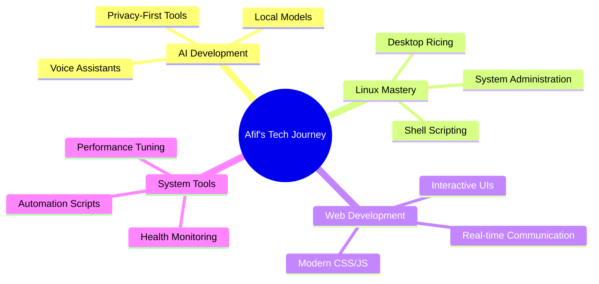

# Hi there! 👋 I'm Afif

<div align="center">


</div>

## 🎯 About Me

```yaml
name: "Afif"
located_in: "Indonesia"
current_job: "Accounting Student"
passion: "Linux Enthusiast & AI Tinkerer"
setup: "EndeavourOS + KDE/Hyprland"
hobbies: ["Gaming", "Anime", "System Ricing", "AI Development"]
motto: "Learning through breaking things, then fixing them better"
```

## 💻 Current Tech Stack

<details>
<summary>🖥️ <strong>Desktop Environment</strong></summary>

- **OS**: EndeavourOS (Arch-based)
- **DE**: KDE Plasma 6 
- **WM**: Hyprland (tiling)
- **Terminal**: Kitty + Konsole
- **Shell**: Fish
- **Theme**: Sweet-Dark + Custom configs

</details>

<details>
<summary>🤖 <strong>Development & AI</strong></summary>

- **Languages**: Python, JavaScript, Shell
- **Frameworks**: FastAPI, Electron, Flask
- **AI Stack**: Ollama, Gemma 3, Whisper, Piper
- **Tools**: Git, Poetry, npm, AUR helpers
- **Databases**: SQLite, JSON storage

</details>

<details>
<summary>🎮 <strong>Gaming & Entertainment</strong></summary>

- **Platform**: PC (Windows 11 dual boot)
- **Genres**: Story-driven RPGs, Racing sims
- **Current**: Adventure games, indie titles
- **Anime**: Slice of life, adventure genres
- **Streaming**: Casual YouTube, tech content

</details>

## 📌 Pinned Projects

> Check out my pinned repositories below! Each one represents a different journey in my tech exploration.

<div align="center">

<table>
  <tr>
    <td>
      <a href="https://github.com/afif25fradana/lyra-voice-assistant">
        
      </a>
    </td>
    <td>
      <a href="https://github.com/afif25fradana/health-check">
        
      </a>
    </td>
  </tr>
  <tr>
    <td>
      <a href="https://github.com/afif25fradana/Felis-Shell-Modular-Dotfile.git">
        
      </a>
    </td>
    <td>
      <a href="https://github.com/afif25fradana/afif25fradana.github.io">
        
      </a>
    </td>
  </tr>
</table>

</div>

## 🎨 My Desktop Gallery

<div align="center">

### 🐧 Linux Setup (EndeavourOS)
 

**KDE Plasma 6** *(Daily Use)* | **Hyprland** *(Daily Use but Different Skin lol)*

</div>

## 🚀 What I'm Building

<table>
<tr>
<td width="50%">

### 🤖 AI & Automation
- Voice interface for desktop assistant
- Semantic memory system with embeddings
- Local AI model optimization
- Desktop integration tools

</td>
<td width="50%">

### 🐧 Linux & System Tools  
- Multi-distro health monitoring
- Automated rice deployment
- AUR package maintenance
- Performance optimization scripts

</td>
</tr>
</table>

## 📊 GitHub Analytics

<div align="center">

<table>
  <tr>
    <td>
      <a href="https://github.com/afif25fradana">
        
      </a>
    </td>
    <td>
      <a href="https://github.com/afif25fradana">
        
      </a>
    </td>
  </tr>
</table>

</div>

<div align="center">
  


</div>

## 🎯 Current Focus Areas



## 🤝 Let's Connect!

<div align="center">

[](https://afif25fradana.github.io/)
[](https://www.instagram.com/afif_fradana/)
[](mailto:fradanaafif@gmail.com)

</div>

## 🎪 Fun Corner

<details>
<summary>💡 <strong>Random Facts About Me</strong></summary>

- 🌙 **Best Coding Hours**: When I have the guts to do it
- 🔥 **Biggest Win**: Successfully rice-ing my desktop without breaking it
- 😅 **Biggest Fail**: Accidentally wiping my /home partition and windows partition too
- 🎯 **Current Goal**: Build offline AI assistant (I hope it’s worth it)
- 🌸 **Guilty Pleasure**: Spending hours tweaking window manager configs and somehow breaking everything

</details>

<div align="center">

### 💖 Thanks for visiting!

*"I Hate Coding but I Love Create Something on My Own"*

```ascii
         |\      _,,,---,,_
    ZZZzz /,`.-'`'    -.  ;-;;,_
         |,4-  ) )-,_. ,\ (  `'-'
        '---''(_/--'  `-'\_)
```

</div>

---
